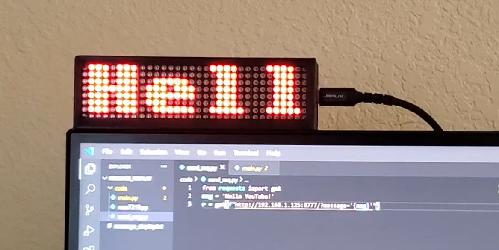
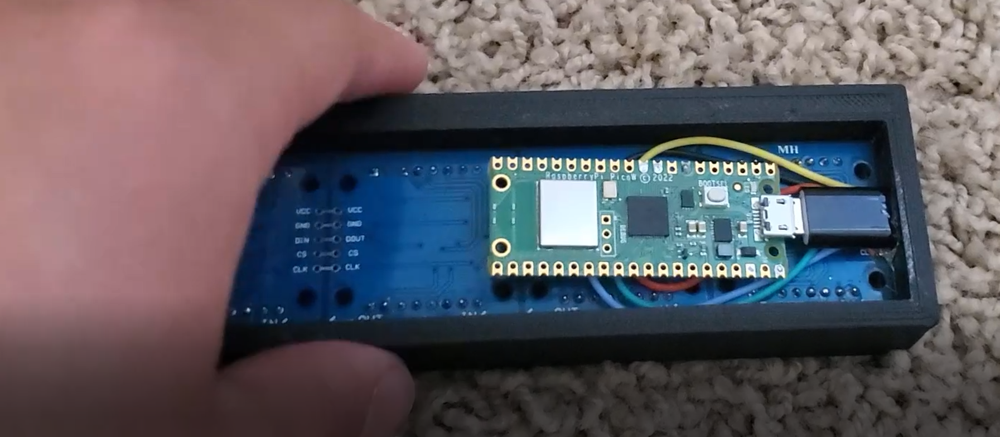

# **Pico W Dot Matrix**
##### This repo contains the code and files necessary to build the Pico W Dot Matrix project  
##### Build guide: https://youtu.be/  
##### My YouTube channel: https://www.youtube.com/channel/UCn5eZ8l-LLnRv9ov-WQtwqA

### **INFO:** 
All you have to do is plug the project in and send GET requests to it using the format in send_req.py  
The print files here aren't the same as in the video; the ones here allow you to set the project on a flat surface.   
A possible improvement to this project would be using POST requests and including the message in the body. I'm kind of lazy, though!  
Probably the majority of the code here isn't my own, but I'm including it in this repo in case the developers decide to change their code.    
Max7219 Driver: https://github.com/mcauser/micropython-max7219 (Mike Causer)  
Pico integration of Max7219 driver: https://github.com/FideliusFalcon/rpi_pico_max7219/blob/main/main.py (FideliusFalcon)  
Webserver setup: https://www.raspberrypi.com/news/how-to-run-a-webserver-on-raspberry-pi-pico-w/ (Alasdair Allan)    
Micro-USB to USB-C adapter: https://www.amazon.com/dp/B087WKS9NZ

